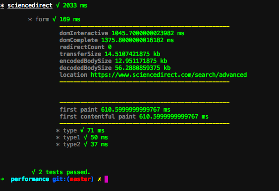

## BIGBROTHER


BigBrother is a simple tool that aims to provide insights of how our pages are performing. Similar to mocha, it will allow you to define testing scenarios and execute them with different Network/CPU throttling options.

BigBrother will execute each defined test scenario inside an instance of [Puppeteer](https://github.com/GoogleChrome/puppeteer). Once every scenario has been executed, BigBrother will provide a report of the time needed by each operation to be concluded. It will also provide useful informations about the page itself, such as `FirstMeaningFulPaint`, `domInteractive`, `domComplete`, `transferSize` and so on.

The tool allows you to record every scenario. Check the [syntax](#syntax) chapter for further instructions. Once a scenario has been recorder, further runs of BigBrother will use the stored informations as reference: if running the tests brings timing above the recorded reference, the test will fail and BigBrother will finish with an error.

Similar to mocha, BigBrother can be easily included in your pipeline: if performance drops below your expected level, tests will fail and the tool will return with 1.

---

### Installation

`npm install --save-dev github:sdfe/sd-browser-perf#v0.0.3`

---

### Usage

Run bigbrother like so:

`bigbrother -p "**/*.perf.js"`

or inside your `package.json`:

```json
    "scripts": {
        ...
        "test:performance": "bigbrother -p '**/*.perf.js'"
    }
```
Bigbrother requires scenarios to be defined inside `*.perf.js` files. Check the [syntax](#syntax) chapter for further instructions. The `*.perf.js` extension is not mandatory but it's recommended to use a different extension from the one used in your source code.

#### available flags:

- `-v`: will run bigbrother in verbose mode. Not required.
- `-p`: this defines the pattern used by bigbrother. This flag is required, an error will be printed if missing.

---

### Syntax

BigBrother gives you two global functions:

- `measure`: will accept a name and a callback function, it's used as entry point, and it allows you to properly configure your scenarios.

- `scenario`: will accept a name and an async callback function. This is the definition of your scenario and it follows the syntax described below. Each scenario has to be defined within the `measure` function scope.


##### measure:

```javascript
    measure('SD_Search', function(config) {

        config.setURL('INSERT URL HERE');
        config.setNetwork(NETWORK.SLOW3G);
        config.setCPU(CPU.DEFAULT);

        scenario('...', async (page) => { ...});
        scenario('...', async (page) => { ...});
        scenario('...', async (page) => { ...});
    });
```

The measure function accepts two arguments, the name for the entire suite and a callback function.

The callback function receives a `config` object, which holds the configuration for the current test suite.

Config has three methods:

- `setURL`: this will receive a String, the URL that will be used for the entire suite of tests.
- `setCPU`: this will receive an object with the CPU configuration for the entire suite.
- `setNetwork`: this will receive an object with the Network configuration for the entire suite.

`NETWORK` and `CPU` are two objects globally available, and they are defined like so:

```javascript
const NETWORK = {
    WIFI: {
        offline: false,
        latency: 28,
        downloadThroughput: 5000000,
        uploadThroughput: 1000000
    },
    DSL: {
        offline: false,
        latency: 50,
        downloadThroughput: 1500000,
        uploadThroughput: 384000
    },
    SLOW3G: {
        offline: false,
        latency: 400,
        downloadThroughput: 400000,
        uploadThroughput: 400000
    },
    REG3G: {
        offline: false,
        latency: 300,
        downloadThroughput: 1600000,
        uploadThroughput: 768000
    },
    FAST3G: {
        offline: false,
        latency: 170,
        downloadThroughput: 1600000,
        uploadThroughput: 768000
    },
    REG4G: {
        offline: false,
        latency: 150,
        downloadThroughput: 9000000,
        uploadThroughput: 9000000
    },
    LTE: {
        offline: false,
        latency: 70,
        downloadThroughput: 12000000,
        uploadThroughput: 12000000
    },
    EDGE: {
        offline: false,
        latency: 840,
        downloadThroughput: 240000,
        uploadThroughput: 240000
    },
    REG2G: {
        offline: false,
        latency: 800,
        downloadThroughput: 280000,
        uploadThroughput: 256000
    },
    OFFLINE: {
        offline: true,
        latency: 10000,
        downloadThroughput: 0,
        uploadThroughput: 0
    }
}
```

Each entry in the Network object represents a different Network configuration. A custom configuration can be provided, assuming that each key has a value. Wrong configurations will be ignored (hopefully).

```javascript
const CPU = {
    DEFAULT: {
        rate: 1
    },
    SLOW_2: {
        rate: 2
    },
    SLOW_3: {
        rate: 3
    },
    SLOW_4: {
        rate: 4
    },
    SLOW_5: {
        rate: 5
    },
    SLOW_6: {
        rate: 6
    },
    SLOW_7: {
        rate: 7
    },
    SLOW_8: {
        rate: 8
    },
    SLOW_9: {
        rate: 9
    },
    SLOW_10: {
        rate: 10
    }
}
```

Each entry represents how slow the CPU will be: for example, `SLOW_4` means that CPU will be 4x slower than normal. A custom configuration can be provided, assuming that each key has a value. Wrong configurations will be ignored (hopefully).

##### scenario:

Since BigBrother relies on Puppeteer, each scenario uses 100% of puppeteer syntax. Please go to [https://pptr.dev/](https://pptr.dev/) for more informations about Puppeteer API.

Each scenario is defined by a name and an async arrow function. BigBrother currently only supports async arrow functions. The callback function will receive the instance of the current page of Puppeteer.

Each instruction for the page object should be an `await` expression. BigBrother currently only supports await expressions.

Here is an example:

```javascript

    measure('SD_Search', function(config) {
        ...

        scenario('Submit', async (page) => {
            await page.type('input#qs', 'Who did this?');
            await page.type('input#authors', 'Marco');
            await page.type('input#date', '1990');

            await page.keyboard.sendCharacter('\n');
        });
    })

```

---

### Output

Once every scenario has been executed, the following ouTput will be provided.



### Contributing

??? Ask Marco

### Licence

???
